# Water Level Monitoring Dashboard - System Flowchart

## 🌊 WaterWatch Pro - Complete System Flow

```mermaid
flowchart TD
    A[🚀 Application Start] --> B[📊 Dashboard Initialization]
    
    B --> C{📍 Load Station Data}
    C --> D[🗺️ Initialize Map View]
    C --> E[📈 Setup Chart Components]
    C --> F[🤖 Initialize AI Chatbot]
    C --> G[🔮 Setup Predictions Engine]
    
    %% Data Sources
    H[📁 Mock Data Generator] --> I[⏱️ Real-time Updates Every Minute]
    J[📤 User Data Upload] --> K[🔍 Data Validation & Parsing]
    
    %% Main Dashboard Flow
    D --> L[🗺️ Map View Tab]
    E --> M[📊 Overview Tab]
    G --> N[🔮 AI Predictions Tab]
    F --> O[💬 AI Assistant Tab]
    
    %% Overview Tab Flow
    M --> P{📈 Chart Display}
    P --> Q[📊 Station Selection]
    Q --> R[⏰ Time Range Selection]
    R --> S{🔄 Data Source Check}
    
    S -->|Mock Data| T[🎲 Generate Realistic Data]
    S -->|Uploaded Data| U[📁 Use Custom Dataset]
    
    T --> V[📈 Render Chart]
    U --> V
    V --> W[📊 Display Statistics]
    W --> X[🔄 Auto-refresh Every Minute]
    X --> S
    
    %% Data Upload Flow
    Y[📤 Upload Data Button] --> Z[📋 Station Info Form]
    Z --> AA{✅ Form Validation}
    AA -->|Invalid| AB[❌ Show Error Message]
    AA -->|Valid| AC[📁 File Selection]
    
    AC --> AD{📄 File Type Check}
    AD -->|CSV| AE[📊 Parse CSV Data]
    AD -->|JSON| AF[🔧 Parse JSON Data]
    AD -->|Invalid| AG[❌ Unsupported Format]
    
    AE --> AH[🔍 Data Validation]
    AF --> AH
    AH --> AI{✅ Validation Result}
    AI -->|Success| AJ[💾 Store Custom Data]
    AI -->|Errors| AK[📝 Show Error Report]
    
    AJ --> AL[🔄 Update Chart Display]
    AL --> AM[📊 Switch to Custom Data View]
    
    %% Map View Flow
    L --> AN[🗺️ Initialize Leaflet Map]
    AN --> AO[📍 Plot Station Markers]
    AO --> AP{🎨 Marker Color Logic}
    
    AP -->|Online| AQ[🟢 Green Marker]
    AP -->|Offline| AR[🔴 Red Marker]
    AP -->|Maintenance| AS[🟡 Yellow Marker]
    AP -->|Critical Alert| AT[🚨 Red with Alert Count]
    
    AQ --> AU[📋 Station Popup]
    AR --> AU
    AS --> AU
    AT --> AU
    
    AU --> AV[ℹ️ Station Details Display]
    AV --> AW[🔗 View Details Button]
    
    %% AI Predictions Flow
    N --> AX[🧠 AI Predictions Panel]
    AX --> AY[📊 Station Selection]
    AY --> AZ[🔮 Generate Predictions]
    
    AZ --> BA[📈 Historical Data Analysis]
    BA --> BB[🤖 ML Model Processing]
    BB --> BC[📊 24-Hour Forecast]
    BC --> BD[📈 Confidence Intervals]
    BD --> BE[⚠️ Risk Assessment]
    
    BE --> BF{🚨 Risk Level}
    BF -->|Low| BG[🟢 Normal Status]
    BF -->|High| BH[🟡 Warning Status]
    BF -->|Critical| BI[🔴 Critical Alert]
    
    BG --> BJ[📊 Display Prediction Chart]
    BH --> BJ
    BI --> BJ
    
    BJ --> BK[📋 Forecast Table]
    BK --> BL[📊 Model Performance Metrics]
    
    %% AI Chatbot Flow
    O --> BM[🤖 Chatbot Interface]
    BM --> BN[💬 User Message Input]
    BN --> BO[🔍 Message Analysis]
    
    BO --> BP{🎯 Query Type Detection}
    BP -->|Station Query| BQ[📊 Station-specific Response]
    BP -->|System Status| BR[📈 System Overview Response]
    BP -->|Alerts| BS[⚠️ Alert Summary Response]
    BP -->|Predictions| BT[🔮 Prediction Response]
    BP -->|Help| BU[❓ Help Response]
    BP -->|General| BV[🤖 General AI Response]
    
    BQ --> BW[💬 Generate Response]
    BR --> BW
    BS --> BW
    BT --> BW
    BU --> BW
    BV --> BW
    
    BW --> BX[📱 Display Bot Message]
    BX --> BY[⏱️ Typing Simulation]
    BY --> BZ[💬 Add to Chat History]
    
    %% Real-time Updates
    I --> CA[🔄 Update Station Data]
    CA --> CB[📊 Refresh Charts]
    CB --> CC[🗺️ Update Map Markers]
    CC --> CD[⚠️ Check Alert Conditions]
    CD --> CE[🔔 Trigger Notifications]
    
    %% Alert System
    CE --> CF{🚨 Alert Type}
    CF -->|Critical| CG[🔴 Critical Alert Badge]
    CF -->|Warning| CH[🟡 Warning Alert Badge]
    CF -->|Info| CI[🔵 Info Alert Badge]
    
    CG --> CJ[📊 Update Dashboard Stats]
    CH --> CJ
    CI --> CJ
    
    %% Navigation Flow
    CJ --> CK[🧭 Tab Navigation]
    CK --> CL{📱 Active Tab}
    CL -->|Overview| M
    CL -->|Map| L
    CL -->|Predictions| N
    CL -->|Chat| O
    
    %% Error Handling
    AB --> CM[🔄 Return to Form]
    AG --> CM
    AK --> CM
    
    %% Data Persistence
    AM --> CN[💾 Session Storage]
    CN --> CO[🔄 Maintain State]
    CO --> CP[📊 Consistent Display]
    
    %% Performance Optimization
    CP --> CQ[⚡ Lazy Loading]
    CQ --> CR[🎯 Component Optimization]
    CR --> CS[📱 Responsive Design]
    CS --> CT[✨ Smooth Animations]
    
    %% Styling Classes
    classDef startEnd fill:#e1f5fe,stroke:#01579b,stroke-width:3px
    classDef process fill:#f3e5f5,stroke:#4a148c,stroke-width:2px
    classDef decision fill:#fff3e0,stroke:#e65100,stroke-width:2px
    classDef data fill:#e8f5e8,stroke:#1b5e20,stroke-width:2px
    classDef error fill:#ffebee,stroke:#c62828,stroke-width:2px
    classDef ai fill:#e3f2fd,stroke:#0d47a1,stroke-width:2px
    
    class A,CT startEnd
    class B,D,E,F,G,L,M,N,O,AN,AX,BM process
    class C,S,AA,AD,AI,AP,BF,BP,CF,CK,CL decision
    class H,I,J,T,U,AJ,CN data
    class AB,AG,AK,CM error
    class BB,BW,BO ai
```



## 🔧 System Components Breakdown

### 1. **🏗️ Core Architecture**
- **Frontend**: React + TypeScript
- **Styling**: Tailwind CSS with custom themes
- **Charts**: Chart.js with React wrapper
- **Maps**: Leaflet with custom markers
- **State Management**: React hooks and context

### 2. **📊 Data Flow Layers**

#### **Input Layer**
- Mock data generator for realistic simulation
- File upload system (CSV/JSON)
- Real-time data simulation

#### **Processing Layer**
- Data validation and parsing
- AI prediction algorithms
- Risk assessment logic
- Alert condition checking

#### **Presentation Layer**
- Interactive charts and graphs
- Dynamic map visualization
- Responsive dashboard layout
- Real-time updates

### 3. **🤖 AI Features**

#### **Prediction Engine**
- Historical data analysis
- Pattern recognition
- Confidence interval calculation
- Risk level assessment

#### **Chatbot Intelligence**
- Natural language processing
- Context-aware responses
- Station-specific queries
- System status reporting

### 4. **🔄 Real-time Operations**

#### **Update Cycle (Every Minute)**
1. Generate new data points
2. Update chart displays
3. Refresh map markers
4. Check alert conditions
5. Update statistics
6. Maintain session state

#### **User Interactions**
- Tab navigation
- Station selection
- Time range filtering
- Data upload workflow
- Chat interactions

### 5. **📱 User Experience Flow**

#### **Dashboard Navigation**
```
Overview Tab → Chart View → Station Selection → Data Display
Map Tab → Interactive Map → Station Markers → Popup Details
Predictions Tab → AI Analysis → Forecast Charts → Risk Assessment
Chat Tab → AI Assistant → Query Processing → Intelligent Responses
```

#### **Data Upload Workflow**
```
Upload Button → Station Form → File Selection → Validation → 
Processing → Success/Error → Chart Update → Custom Data Display
```

### 6. **⚡ Performance Features**
- Lazy loading of components
- Optimized re-rendering
- Efficient data structures
- Responsive design patterns
- Smooth animations and transitions

### 7. **🛡️ Error Handling**
- File format validation
- Data integrity checks
- Network error handling
- User input validation
- Graceful fallbacks

This flowchart represents the complete system architecture and user journey through the Water Level Monitoring Dashboard prototype.